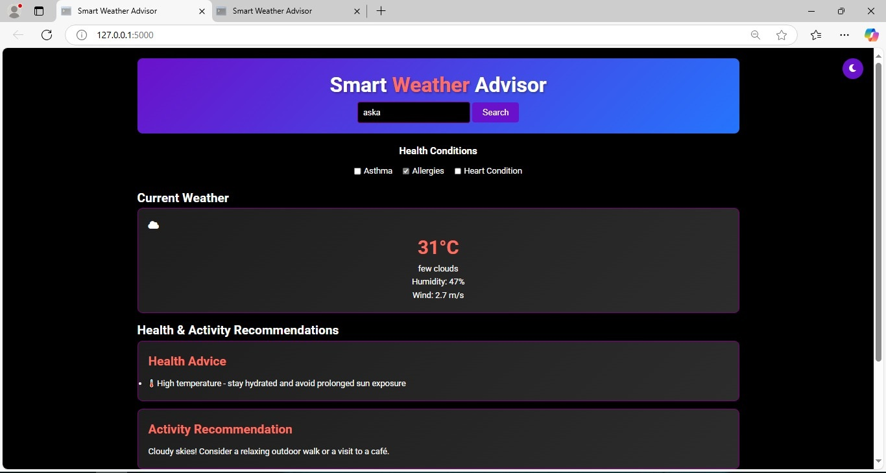
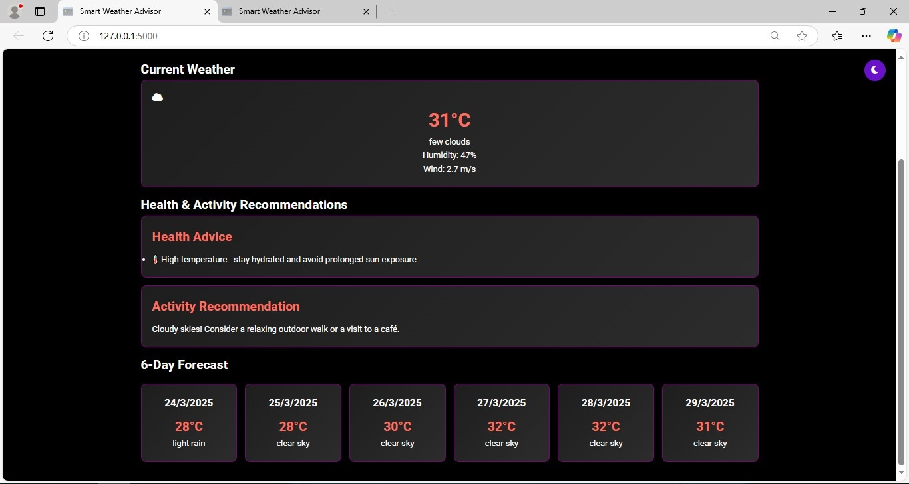

# 🌦️ Google AI Weather Prediction Model

This project is an AI-powered weather forecasting system built using multiple machine learning models. It utilizes historical weather data to predict future conditions such as temperature, humidity, and more. The predictions are served through a Flask-based web interface, allowing users to interact with the model easily.

## 🚀 Features

- Predicts key weather parameters like temperature, humidity, etc.
- Uses multiple ML models for comparison and accuracy
- Fully functional Flask web app for user interaction
- Cleanly structured, modular code for easy customization
- Rich data visualizations for model insights and trends

## 🧠 Tech Stack

- **Python**
- **Flask** (for the web interface)
- **Pandas**, **NumPy** (data handling)
- **Matplotlib**, **Seaborn** (visualizations)
- **Scikit-learn**, **XGBoost**, **TensorFlow** (machine learning)
- **Jupyter Notebook** (for prototyping and model development)

## ⚙️ How to Run

1. Clone the repository:

   git clone https://github.com/SuprabhaPanigrahi/Weather-Prediction-using-AI-and-ML

2. Navigate into the project directory:

   cd weather-prediction

3. (Optional) Create and activate a virtual environment:

   - On Linux/macOS:  
     python3 -m venv venv && source venv/bin/activate
   - On Windows:  
     python -m venv venv && venv\Scripts\activate

4. Install all dependencies:

   pip install -r requirements.txt

5. Run the Flask application:

   python app.py

## 📸 Screenshots 

### 🔹 Home Page

### 🔹 Prediction Output

## 📈 Example Predictions

Once the server is running, you can input your city name and receive predictions such as:

- Future temperature
- Humidity level
- Rainfall chance

The project supports multiple models behind the scenes, and you can switch or extend them easily.

## 🤝 Contributing

If you'd like to contribute, feel free to fork the repo and submit a pull request.  
For major changes, please open an issue first to discuss what you'd like to improve or add.

## 🙋‍♀️ About Me

Developed with 💙 by **Suprabha**  
GitHub: https://github.com/SuprabhaPanigrahi  
LinkedIn: https://linkedin.com/in/Suprabha-Panigrahi

If you liked this project, give it a ⭐ and share it with your network!
